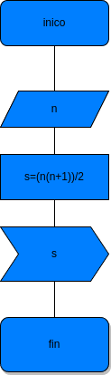

# Suma_n_Numeros
suma de los n primeros naturales

# analisis

## input

### variables de entrada
n: numero al que se desea aplicar la formula
### prosesing
s:
s=(n*(n+1))/2

### output
s
# diseño

# construccion
